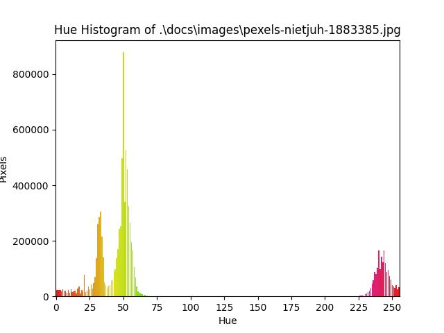

# Huehistogram

A python script to create "hue" histogram of a colored image.

# TLDR

Use python >=3.8. This project uses [astral-sh/uv](https://github.com/astral-sh/uv) as its project manager (and you should try it). Install Huehistogram by cloning this repo and ``uv sync`` to install dependencies.

You have a following image on `path/to/file.png` (A photo by Ylanite Koppens on Pexels: https://www.pexels.com/ja-jp/photo/1883385)


Run the following command to generate a hue histogram of this image:
```
python src/huehistogram_cli.py -i path/to/file.png -o path/to/directory
```

Now open ``path/to/directory/file.png`` to see the hue histogram:
